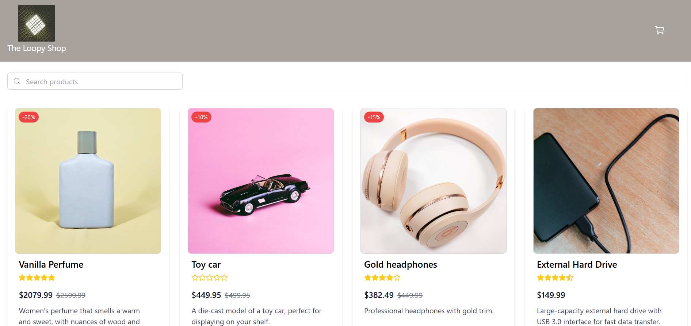

# JS Frameworks CA

Online E-com shop

## Description

This project is a React-based online shop built as part of a school assignment to learn React fundamentals. It fetches product data from an API and allows users to browse products, add multiple items to their cart, view the total number of products in the cart, and see the total price during checkout

## Built With

This project is setup with React + Vite, with React Router and Tailwind CSS
https://react.dev/

## Getting Started

Follow these steps to set up and run the project locally:

1. Clone the repo:
   git clone git@github.com:EmmaCaroline/js-frameworks.git

2. Install dependencies

- Ensure you have Node.js installed. Then, run:
  npm install

3. Start the development server
   npm run dev

4. Open the project in your browser

- Vite will start a development server and provide a local URL (e.g., http://localhost:5173). Open this link in your browser to view the project

5. Build for production (optional)

- npm run build
